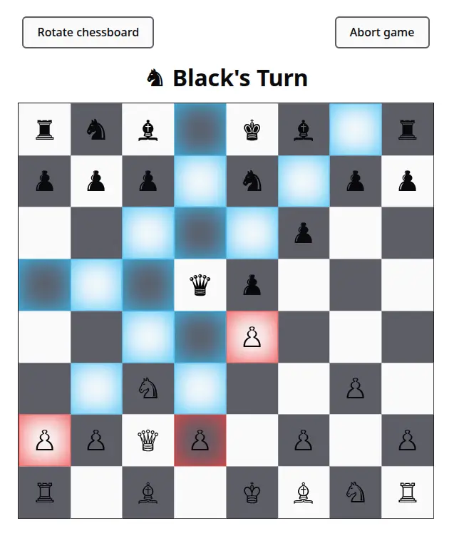

# Chess

This is a client-side [chess](https://en.wikipedia.org/wiki/Chess) game. It follows standard chess rules and supports offline player vs player and player vs AI modes.

## Getting Started

Clone the repository

```bash
  git clone https://github.com/syeero7/chess-game.git
```

Go to the project directory

```bash
  cd chess-game
```

Install dependencies

```bash
  npm install
```

Start the development server

```bash
  npm run dev
```

## Running Tests

To run tests, run the following command

```bash
  npm run test
```

## Screenshots


